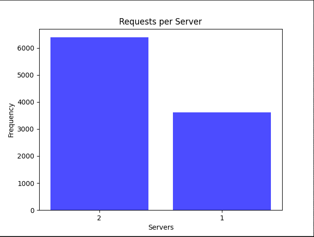
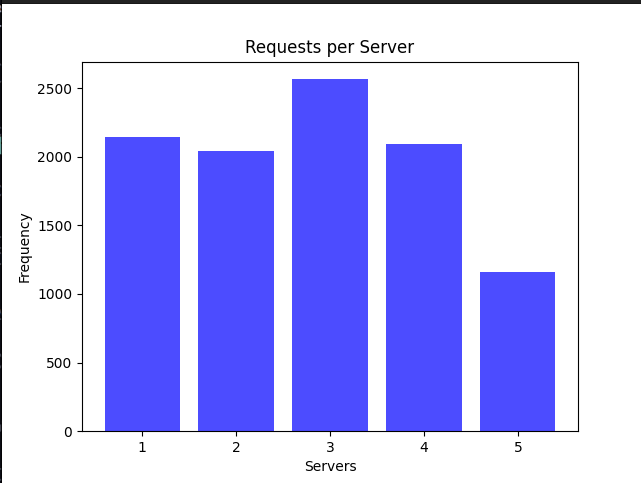

# load_balancer
CS60002: Distributed Systems 

## Assignment 1: Implementing a Customizable Load Balancer with consistent hashing
Contributors for this project are:
- [Yatindra Indoria](https://github.com/yatindra7) - 20CS30060
- [Srishty Gandhi](https://github.com/srishtygandhi-kgp) - 20CS30052
- [Atulya Sharma](https://github.com/r-avenous) - 20CS10012
- [Krishna Venkat Cherukuri](https://github.com/kv2002) - 20CS10019
  
---

## Usage
### Running the load balancer

- To build the Docker containers:
  ```bash
  docker-compose build
  ```
- To start the Docker containers:
  ```bash
  docker-compose up
  ```
- Adding new servers to the container:
  ```bash
  curl -X POST -H "Content-Type: application/json" -d '{"n": 3, "hostnames": ["S1", "S2", "S3"]}' http://localhost:5000/add
  ```
- To get the status of replicas
  ```bash
  curl http://localhost:5000/rep
  ```
- To remove the servers:
  ```bash
  curl -X DELETE -H "Content-Type: application/json" -d '{"n": 2, "hostnames": ["S1", "S2"]}' http://localhost:5000/rm
  ```
- To route to a server
  ```bash
  curl http://localhost:5000/home
  ```

- Cleanup:
  ```bash
  docker ps -a | grep './server' | awk '{print $1}' | xargs docker rm --force
  docker-compose down
  ```

## Analysis
### A1. 10000 async requests on N = 3
  
  - 

We launched 10,000 asynchronous requests on a system with N = 3 server containers. The resulting bar chart indicates non-uniform mapping, with a significant portion of incoming requests directed to a single server. This observation indicates towards the suboptimal nature of the initial hash function, impacting the even distribution of requests among servers. The system's current performance is not ideal due to the hash function's limitations.

Many hashing schemes rely on not needing any state for routing requests, hence the distribution of the requests as well as the choice of the hash function is important for avoiding oversubscription (akin to a hot partition on sharded databases). Analogous to [shard rebalancing](https://shopify.engineering/mysql-database-shard-balancing-terabyte-scale), a hash function change may be needed to adapt to the situation.
  
  ### A2. N from 2 to 6 and launch 10000 requests on each such increment
  
  - 
  - 
  - 
  - 
  - 
  - 

We increased the number of server containers (N) from 2 to 6, launching 10,000 requests at each increment. The accompanying line chart illustrates average server loads at each run. Similar to A1, the non-uniform mapping persists, emphasizing the hash function's impact on request distribution. Despite minor variations, the system displays limitations in scalability and even load balancing as the number of server containers increases.

The system's current state calls for further optimization, as evident from the graphs representing both A1 and A2. If the distribution remains imbalanced, the scaling can't be achieved [horizontally](https://wa.aws.amazon.com/wellarchitected/2020-07-02T19-33-23/wat.concept.horizontal-scaling.en.html) and is hence bound by the vertical limits of a single server instance. The refinement of hash functions, as explored in A4, aims to address these issues and enhance the overall performance of the load balancer.
  
  ### A3. Case of server failure

We simulated server failure by force-killing a server, measuring the time it took for the load balancer to spawn a new container, and recording the hit percentage. The results are summarized in the table below:

  | Number of Containers | Latency   | Hit Percentage |
  |----------------------|-----------|----------------|
  | 2                    | ~440 ms   | 99.43          |
  | 3                    | ~450 ms   | 99.23          |
  | 4                    | ~470 ms   | ~98.5          |
  | 5                    | ~470 ms   | ~99.3          |
  | 6                    | ~500 ms   | ~99.9          |

 - The latency for container respawn increases slightly as the number of containers grows. Increase in server latency, it can be attributed to the fact that as the number of servers increases, the percentage loss in computation power when a server goes down decreases. However, this reduction in loss is accompanied by a slight delay in the container respawn time.
 - Despite minor latency variations, the hit percentage remains consistently high, indicating effective load balancing and server recovery.

These findings suggest that the system efficiently handles server failures, ensuring minimal downtime and maintaining a high hit percentage across different container configurations.


  ### A4. Modifying the hash functions
  We introduced a refined hash function, denoted as H(i), implemented as shown below in code form:
```go
  func H(i uint32) uint32 {
      i = ((i >> 16) ^ i) * 0x45d9f3b
      i = ((i >> 16) ^ i) * 0x45d9f3b
      i = (i >> 16) ^ i
      return i
  }
  
  func Phi(i, j uint32) uint32 {
      return H(i + H(j))
  }
  ```

We adopted this modification based on the algorithm's ability to provide a robust statistical distribution. Each input bit influences each output bit with approximately a 50% probability, ensuring no collisions occur, where each unique input yields a distinct output.

To validate the effectiveness of this modification, we conducted experiments by launching 10,000 asynchronous requests on server containers ranging from N = 2 to N = 6.The graphs illustrating the outcomes reveal a more consistent spread, suggesting better performance compared to the previous hash function.

Here are the images corresponding to the mentioned server configurations:

  - 
  - 
  - 
  - 
  - 
  - 


