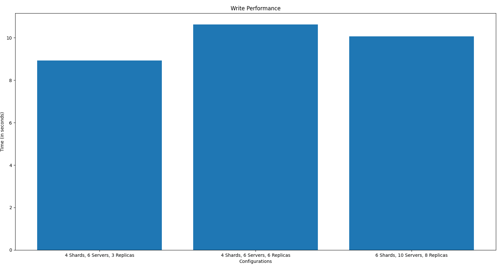
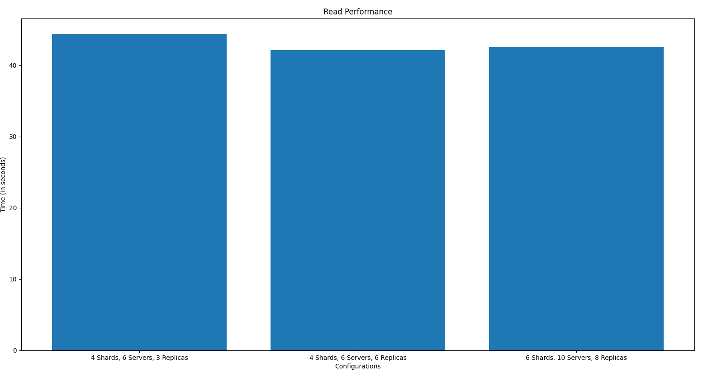

# Assignment 2 | Distributed Database

Contributors for this project are:
- 20CS30060 : [Yatindra Indoria](https://github.com/yatindra7)
- 20CS30052 : [Srishty Gandhi](https://github.com/srishtygandhi-kgp)
- 20CS10012 : [Atulya Sharma](https://github.com/r-avenous)
- 20CS10019 : [Krishna Venkat Cherukuri](https://github.com/kv2002)

## Written in

Load Balancer, Server : Golang  
Scripts: Shell, Python  

## Usage

- `make build`
  - Build images of the load balancer and the server
- `make run` 
  - Run the load balancer
- `make stop`
  - Stop the load balancer
  - Stop any servers still running in the network 
  - Shuts down the docker network
### Analysis
 - `python3 analysis.py`
   - Script to run analysis as given in the assignment

### Sample commands to interact
- Initialize the system  
`curl -X POST -H "Content-Type: application/json" -d '{"N":3, "schema":{"columns":["Stud_id","Stud_name","Stud_marks"], "dtypes":["Number","String","String"]}, "shards":[{"Stud_id_low":0, "Shard_id": "sh1", "Shard_size":4096}, {"Stud_id_low":4096, "Shard_id": "sh2", "Shard_size":4096}, {"Stud_id_low":8192, "Shard_id": "sh3", "Shard_size":4096}], "servers":{"Server0":["sh1","sh2"], "Server1":["sh2","sh3"], "Server2":["sh1","sh3"]}}' http://localhost:5000/init`
- Get system status   `curl -X GET -H "Content-Type: application/json" http://localhost:5000/status`
- Add servers, shards to the system   `curl -X POST -H "Content-Type: application/json" -d '{"N" : 2, "new_shards":[{"Stud_id_low":12288, "Shard_id": "sh5", "Shard_size":4096}], "servers" : {"Server4":["sh3","sh5"], "Server[5]":["sh2","sh5"]}}' http://localhost:5000/add`
- Remove servers   `curl -X DELETE -H "Content-Type: application/json" -d '{"n" : 2, "servers" : ["Server4"]}' http://localhost:5000/rm`
- Read records   `curl -X POST -H "Content-Type: application/json" -d '{"Stud_id": {"low":1000, "high":8889}}' http://localhost:5000/read`
- Write records   `curl -X POST -H "Content-Type: application/json" -d '{"data": [{"Stud_id":2255,"Stud_name":"GHI","Stud_marks":27}, {"Stud_id":3524,"Stud_name":"JKBFSFS","Stud_marks":56}, {"Stud_id":5005,"Stud_name":"YUBAAD","Stud_marks":100}]}' http://localhost:5000/write`
- Update records   `curl -X PUT -H "Content-Type: application/json" -d '{"Stud_id":2255, "data": {"Stud_id":2255,"Stud_name":"GHI","Stud_marks":30}}' http://localhost:5000/update`
- Delete records   `curl -X DELETE -H "Content-Type: application/json" -d '{"Stud_id":2255}' http://localhost:5000/del`

## Task A1
4 Shards | 6 Servers | 3 Replicas
### Write 
- 10000 writes take time =  8.930181 Sec
- 1119.8 writes/sec
### Read
- 10000 reads take time = 44.363342 Sec
- 225.2 reads/sec
## Task A2
4 Shards | 6 Servers | 6 Replicas
### Write
- 10000 writes take time =  10.629226 Sec
- 940.7 writes/sec
### Read
- 10000 reads take time =  42.118915 Sec
- 237.3 reads/sec
## Task A3
6 Shards | 10 Servers | 8 Replicas
### Write
- 10000 writes take time =  10.06756 Sec
- 993.4 writes/sec
### Read
- 10000 reads take time =  42.554858
- 234.9 reads/sec
## Overall Comparison

## A4

### Performance
Time taken (Average) for respawning of a server on different configurations
- 4 Shards | 6 Servers | 3 Replicas : 6.4 Sec
- 4 Shards | 6 Servers | 6 Replicas : 6.3 Sec
- 6 Shards | 10 Servers | 8 Replicas : 6.6 Sec
Operations work fine even after crashing containers